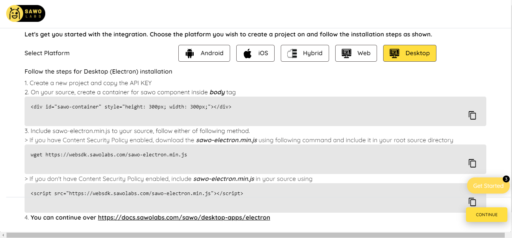

Integrate SAWO in Electron
==========================

Electron is a free and open-source software framework developed and maintained by GitHub. It allows for the development of desktop GUI applications using web technologies.

Let's get our Electron App running with SAWO
============================================

Electron App doesn't need any extra requirement. So, we will directly move on to the steps.

Steps
-----

We need to follow a few steps to get SAWO integrated into our application.

1. As the first step to getting our Electron App to run with SAWO login, we need an essential component, which is the “SAWO API key”. You are probably wondering where we can get these, right? For that, we have to create a project in the SAWO Dashboard, where we can go directly by clicking `here <https://dev.sawolabs.com/>`__.

1.1 Click the “create new project” button. Choose the platform on which we will create our project, where we will be able to see the code beforehand. In this case, it will be “Desktop” as we are creating it on Electron. Click continue.

1.2 Next, give the name of your project. In the “Enter your hostname” section, leave it empty because we will talk about it afterwards. Now, click “create”. There we are. We currently have a project in the SAWO dashboard.

.. image:: ../images/SAWO%203.png

1.3 Now, we can see in the project section the display of details about our project. Open notepad and copy the “API key” because we will need it afterwards.

.. image:: ../images/SAWO%204.png

2. Once we create our project, we would need to set our hostname.

2.1 For development in a local machine, the hostname should be set to 'localhost'. So, write localhost beside the hostname and click "save". 

     - If using ''localhost" as hostname is not working for you, try "127.0.0.1"
.. image:: ../images/SAWO%205.png

2.2 For production, the hostname should be set to your domain.

     - If you are adding your domain, do not add 'https://', ''http://', 'www' or even trailing backslash. Example: We should keep https://dev.sawolabs.com/ as dev.sawolabs.com
.. image:: ../images/SAWO%206.png

3. Firstly, on our source, we have to create a container for sawo component inside body tag. Add this following code:

.. code-block:: none

     

     
This will create the container.
   
    - Every added custom field should be accompanied by a 50px increase in the component height.
    
4. Next, we have to include sawo-electron.min.js to your source, follow either of following method:

If we have Content Security Policy enabled, we have to download the sawo-electron.min.js using following command and include it in our root source directory. The following code will helps us do that:

.. code-block:: none

    wget https://websdk.sawolabs.com/sawo-electron.min.js
    
We have to run this code in the terminal.

If we don't have Content Security Policy enabled, we have to include sawo-electron.min.js in your source using the following snippet:

.. code-block:: none

    

5. Lastly, we have to add the snippet at bottom of source inside body tag:

.. code-block:: none

      
      
6. Once we successfully set up the SAWO SDK with the instructions above, we will get the SAWO login form in our application as shown below:

.. image:: ../images/Untitled%20(10).png

Congratulations! You have successfully integrated SAWO with your Electron Application. 

Conclusion
----------

Hope you have enjoyed this short tutorial. We know this can be hard for a first-timer. If you got stuck, tell us where you got stuck in the #ask-for-help channel in our `official discord server <https://discord.com/invite/TpnCfMUE5P>`__, and our engineers will help you out.

*Enjoy with SAWO and we will see you next time.*
