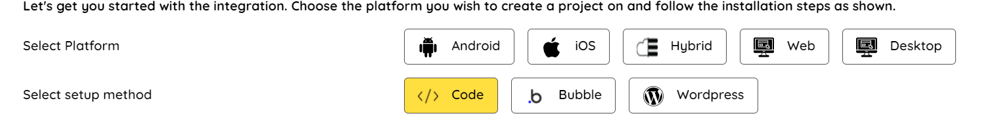
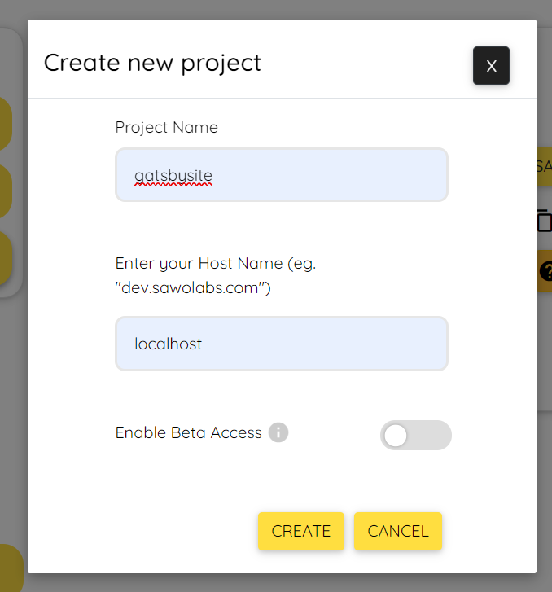

# Integrate SAWO in your Gatsby Site

Gatsby is a React-based open-source framework for creating websites and apps. It combines the control and scalability of dynamically rendered sites with the speed of static-site generation that helps developers build blazing fast websites and apps.

# Requirements

Node [Version 14.5+ ], Node Package Manager (NPM) [Version 6.x+]
You can find detailed steps to install the requirements with the help of [Gatsby documentation](https://www.gatsbyjs.com/docs/tutorial/part-0/).

# Get Started

Once the requirements are satisfied, you can move head with further steps.

## 0. Create a Gatsby site

Refer to the official [documentation](https://www.gatsbyjs.com/docs/quick-start/) of Gatsby to create your first Gatsby site.

## 1. Generate SAWO API key

- Navigate to SAWO Dashboard if you have an account or create a new account [here](https://dev.sawolabs.com/) by logging in.

- In your SAWO dashboard, click on the create project button at the bottom left to create a new project.
  

- Choose web and then code since you'll be using react framework Gatsby and writing the custom code yourselves.



Click continue. You'll be see a similar prompt like the one below.


- Name your project with relevant name. I've named it 'gatsbysite'.
  2.1 For development in a local machine, the hostname should be set to 'localhost'.

  > If using "localhost" as hostname is not working for you, try "127.0.0.1"

  2.2 For production, the hostname should be set to your domain.

  > If you are adding your domain do not add 'https://', ''http://', 'www' or even trailing backslash. Example: https://dev.sawolabs.com/ should be kept as dev.sawolabs.com

On clicking create button, you can successfully see the API key created and SAWO keys csv file downloaded.

## 2. Integrate SAWO in Gatsby

- Before you can use SAWO API, you'll have to install the SAWO Package. Enter the following command in your terminal. (Make sure you're inside your Gatsby site folder)

  ```shell
  npm i sawo
  ```

- Open your preferred page for login and enter the import line below to import sawo class.

  ```js
  import Sawo from 'sawo'
  ```

- You can create a login page using below code.

  ```js
  import React, { useEffect } from 'react'
  import Sawo from 'sawo'
  import { navigate } from 'gatsby'
  ```

  ```js
  // styles
  const pageStyles = {
    color: '#232129',
    padding: 96,
    fontFamily: '-apple-system, Roboto, sans-serif, serif',
  }
  const headingStyles = {
    marginTop: 0,
    marginBottom: 64,
    maxWidth: 320,
  }
  ```

  ```js
  // markup
  const IndexPage = () => {
    useEffect(() => {
      var config = {
        // should be same as the id of the container created on 3rd step
        containerID: 'CONTAINER_ID_HERE',
        // can be one of 'email' or 'phone_number_sms'
        identifierType: 'email',
        // Add the API key copied from 5th step
        apiKey: 'API_KEY_HERE',
        // Add a callback here to handle the payload sent by sdk
        onSuccess: (payload) => {
          // you can use this payload for your purpose
          navigate('/TO_PAGE_HERE')
        },
      }
      let sawo = new Sawo(config)
      sawo.showForm()
    }, [])
    return (
      <main style={pageStyles}>
        <title>Login Page</title>
        <h1 style={headingStyles}>Login Page</h1>
        <div
          id="sawo-container"
          style={{ height: '300px', width: '400px' }}
        ></div>
      </main>
    )
  }

  export default IndexPage
  ```

- Replace the 'CONTAINER_ID_HERE' with the id of your div. In the above code it is 'sawo-container'.

- Replace 'API_KEY_HERE' with the api key from your sawo dashboard. Make sure to enquote it.

- Finally, on successful payload, do your preferred action. In this case, it is redirecting to new page.

This is how our login page looks like


## 3. Conclusion

"Congratulations! You have made it till the end and have learned how to integrate SAWO in your Gatsby site. It's time to give yourself a pat on the back and take a break! In case you're facing difficulties, Here's a [working demo](https://youtu.be/Vvl3WwVr5tg) of the tutorial you just went over. Find the source code for the same [here](https://github.com/irsayvid/gatsby-sawo)."

# What's Next?

If you love to experiment, feel free to look at the [SAWO documentation](https://docs.sawolabs.com/sawo/) for integration in React, Django and other frameworks. Keep building :)
