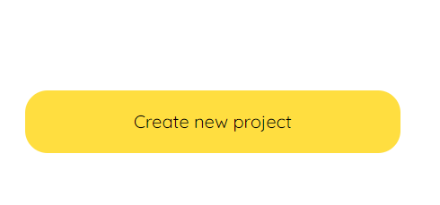
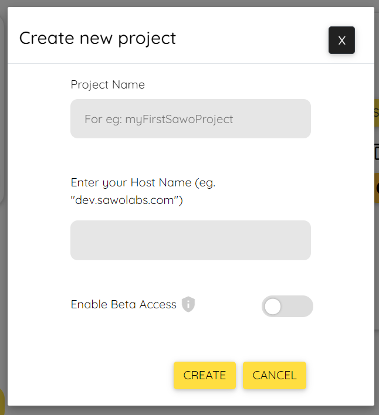
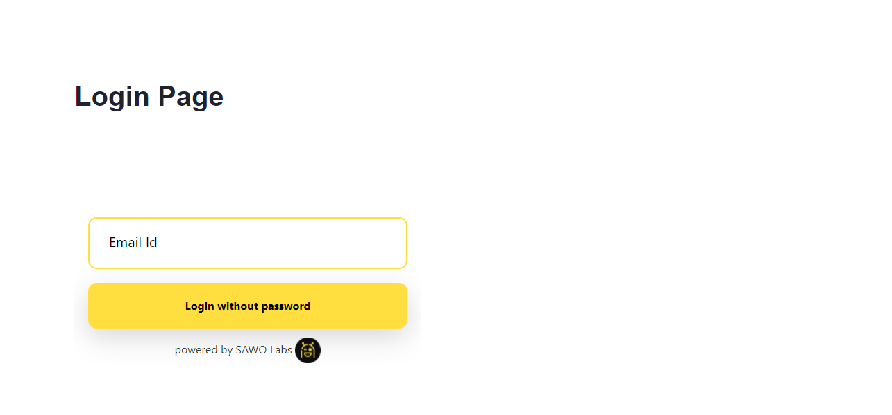

# Authentication in Next.js with SAWO

Next.js is a React framework specially focused on production. It provides hybrid static & server rendering. It has TypeScript support, smart bundling, route prefetching, and more without the need for any config.

# Requirements

- [Node.js 15.5+](https://nodejs.org/en/) or later
- MacOS, Windows (including WSL), and Linux are supported
- npm (comes bundled with node.js) or [yarn](https://yarnpkg.com/getting-started/install)

# Get Started

Once the requirements are satisfied, we can go ahead with further steps.

## 0. Create Next app

Enter the following command in the terminal to create a Next.js app.

```sh
npx create-next-app@latest
# or
yarn create next-app
```

## 1. Generate SAWO API key

- Navigate to SAWO Dashboard or create a new account [here](https://dev.sawolabs.com/) and log in.

- In the SAWO dashboard, click on the create project button at the bottom left to create a new project.
  

- Choose web and then code since we're working with react framework and will be writing the custom code ourselves.


Click continue. You'll see a similar prompt like the one below.


- Name your project with a relevant name.
  2.1 For development in a local machine, the hostname should be set to 'localhost'.

  > If using "localhost" as hostname is not working for you, try "127.0.0.1"

  2.2 For production, the hostname should be set to your domain.

  > If you are adding your domain do not add 'https://', ''http://', 'www' or even trailing backslash. Example: https://dev.sawolabs.com/ should be kept as dev.sawolabs.com

On clicking the create button, we can successfully see the API key created prompt and SAWO keys csv file downloaded.

## 2. Installing SAWO Package

- Before we can use the SAWO API, we'll have to install the SAWO module. Use the following command in the next js app folder to install the SAWO package.

  ```sh
  npm i sawo
  # or
  yarn add sawo
  ```

## 3. Implement Authentication in Next.js using SAWO

- Enter the import line below in the login page to import the sawo class. Here the login page refers to the file where we're planning to show the login form (say index.js).

  ```js
  import Sawo from 'sawo'
  ```

- Now, let's import the useEffect hook from React which runs only after the component is rendered.
  ```js
  import { useEffect } from 'react'
  ```
- Inside the useEffect hook, let's add our configuration for SAWO login form

  ```js
  var config = {
    // should be same as the id of the container
    containerID: 'CONTAINER_ID_HERE',
    // can be one of 'email' or 'phone_number_sms'
    identifierType: 'IDENTIFIER_HERE',
    // Add the API key
    apiKey: 'API_KEY_HERE',
    // Add a callback here to handle the payload sent by sdk
    onSuccess: (payload) => {
      // you can use this payload for your purpose
    },
  }
  ```

  - Replace the 'CONTAINER_ID_HERE' with the id of your div.
  - Replace the 'IDENTIFIER_HERE' with either 'email' or 'phone_number_sms'
  - Replace 'API_KEY_HERE' with the api key from your sawo dashboard.
  - Finally, on successful payload, do your preferred action.

- Now, let's create an instance of the SAWO class

  ```js
  let sawo = new Sawo(config)
  ```

- To show the form in the container, let's call the showForm method with the instance created

  ```js
  sawo.showForm()
  ```

- Combining all the above pieces of code, we get the below one

  ```js
  import Sawo from 'sawo'
  import { useEffect } from 'react'
  import { useRouter } from 'next/router'
  export default function Home() {
    const router = useRouter()
    useEffect(() => {
      var config = {
        // should be same as the id of the container created
        containerID: 'sawo-container',
        // can be one of 'email' or 'phone_number_sms'
        identifierType: 'email',
        // Add the API key
        apiKey: '9abb02a7-4ba9-471e-b8d7-814e0b5c9dac',
        // Add a callback here to handle the payload sent by sdk
        onSuccess: (payload) => {
          // you can use this payload for your purpose
          router.push('/greetings')
        },
      }
      let sawo = new Sawo(config)
      sawo.showForm()
    }, [])
    return (
      <div>
        <h1>Login Page</h1>
        <div
          id="sawo-container"
          style={{ height: '400px', width: '400px' }}
        ></div>
      </div>
    )
  }
  ```

- If you have followed the tutorial well, you'll see a login form similar to the one given below.
  

## 4. Conclusion

Congratulations! You have made it till the end and have learnt how to implement authentication in Next.js with SAWO. In case you're facing difficulties, here's a [working demo](https://youtu.be/) of the tutorial you just went over. Find the source code for the same [here](https://github.com/irsayvid/nextjsauth).

# What's Next?

Now that you've learnt how to authenticate in Next.js, feel free to look at the [SAWO documentation](https://docs.sawolabs.com/sawo/) for authentication in various web frameworks, mobile apps and no code platforms. Keep building :)
