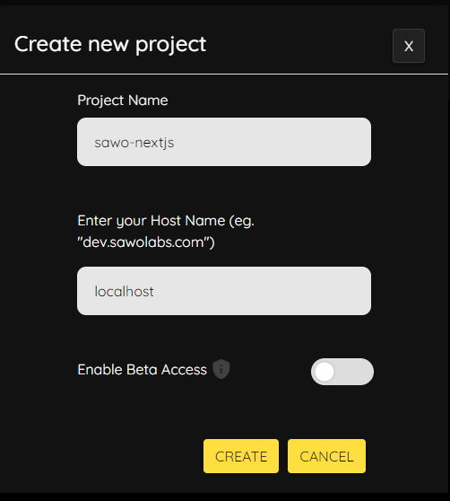
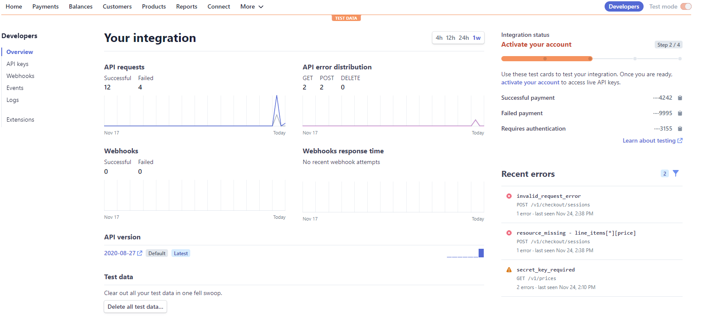
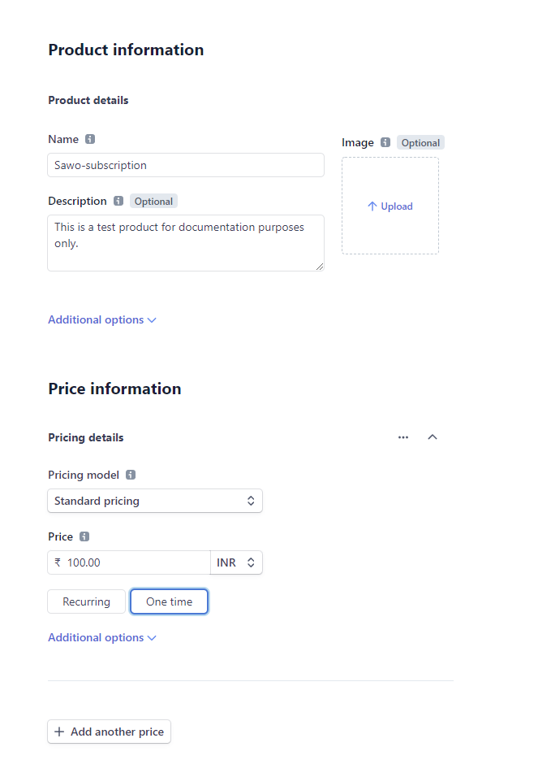
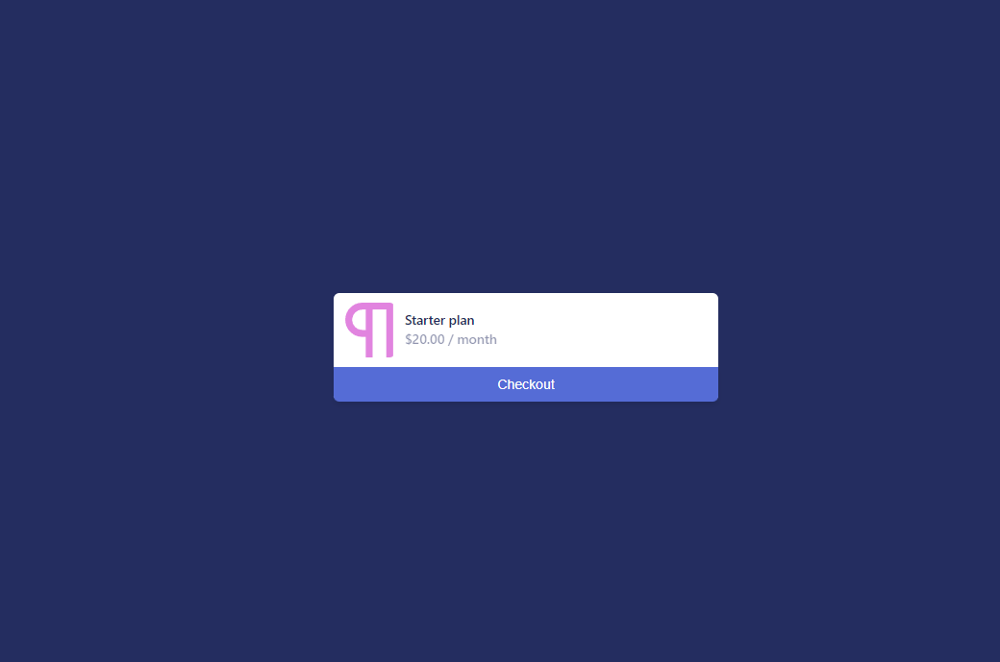

# Build a paid membership site with Stripe and Sawo

**Stripe:** &nbsp;Online payment processing for internet businesses. Stripe is a suite of payment APIs that powers commerce for online businesses of all sizes.


# Requirements

- [Node.js 15.5+](https://nodejs.org/en/) or later
- MacOS, Windows (including WSL), and Linux are supported
- npm (comes bundled with node.js) or [yarn](https://yarnpkg.com/getting-started/install)


# Steps


## 1. Generate SAWO API key

- Navigate to SAWO Dashboard or create a new account [here](https://dev.sawolabs.com/) and log in.

- In the SAWO dashboard, click on the create project button at the bottom left to create a new project.
  

- Choose web and then code since we're working with react framework and will be writing the custom code ourselves.


Click continue. You'll see a similar prompt like the one below.


- Name your project with a relevant name.
  2.1 For development in a local machine, the hostname should be set to 'localhost'.

  > If using "localhost" as hostname is not working for you, try "127.0.0.1"

  2.2 For production, the hostname should be set to your domain.

  > If you are adding your domain do not add 'https://', ''http://', 'www' or even trailing backslash. Example: https://dev.sawolabs.com/ should be kept as dev.sawolabs.com

On clicking the create button, we can successfully see the API key created prompt and SAWO keys csv file downloaded.

## 2. Generate Stripe API key and create a product with price

- Navigate to Stripe Dashboard or create a new account [here](https://stripe.com/) and log in.

- In the Stripe dashboard, click on the developers option.


- In the developers section head to API keys, and there you can find the secret key and publishable key.

- Move to the products option to create your products with prices.


- You will be able to see your price id in front of the price info after creating the product.

## 3. Install the dependencies

Enter the following command in the terminal to create a Next.js app.

```sh
npm i stripe, express
```


## 4. Make endpoints in index.js file and serve your HTML files

- Now, create an instance of express and path

  ```js
  const express = require("express");
  const app = express();
  const path = require("path");
  ```

- Serve the html files

  ```js
  app.use(express.static(path.join(__dirname, "public")));
  app.get("/", (req, res) => {
  res.sendFile(__dirname + "/index.html");
  });
  app.get("/login", (req, res) => {
  res.sendFile(__dirname + "/public/login.html");
  });
  app.get("/success", (req, res) => {
  res.sendFile(__dirname + "/public/success.html");
  });
  app.listen("3000", console.log("Listening on port 3000."));
  ```

- Next, let's create an instance of stripe 
  ```js
  const stripe = require('stripe')('YOUR_STRIPE_SECRET_KEY');
  ```

- Import the price id generated above

  ```js
  const priceId = 'YOUR_PRICE_ID';
  ```

- Create a Checkout Session for Stripe

  ```js
  const session = await stripe.checkout.sessions.create({
    billing_address_collection: 'auto',
    line_items: [
      {
        price: prices.data[0].id,
        // For metered billing, do not pass quantity
        quantity: 1,

      },
    ],
    mode: 'subscription',
    success_url: `${YOUR_DOMAIN}/success.html?session_id={CHECKOUT_SESSION_ID}`,
    cancel_url: `${YOUR_DOMAIN}/cancel.html`,
  });

  res.redirect(303, session.url);
  });
  ```

- Get the price from lookup key

  ```js
  const prices = await stripe.prices.list({
    lookup_keys: [req.body.lookup_key],
    expand: ['data.product'],
  });
  ```

- Define the line items:

  ```js
  line_items: [
      {
        price: prices.data[0].id,
        // For metered billing, do not pass quantity
        quantity: 1,

      },
    ],
  ```

- Define the success and cancel urls:

  ```js
    success_url: `${YOUR_DOMAIN}/success.html?session_id={CHECKOUT_SESSION_ID}`,
    cancel_url: `${YOUR_DOMAIN}/cancel.html`,
  ```

- Create a customer portal session:

  ```js
  const returnUrl = YOUR_DOMAIN;

  const portalSession = await stripe.billingPortal.sessions.create({
    customer: checkoutSession.customer,
    return_url: returnUrl,
  });
  ```

- Provision access:

  ```js
  app.post(
  '/webhook',
  express.raw({ type: 'application/json' }),
  (request, response) => {
    const event = request.body;
    // Replace this endpoint secret with your endpoint's unique secret
    // If you are testing with the CLI, find the secret by running 'stripe listen'
    // If you are using an endpoint defined with the API or dashboard, look in your webhook settings
    // at https://dashboard.stripe.com/webhooks
    const endpointSecret = 'whsec_12345';
    // Only verify the event if you have an endpoint secret defined.
    // Otherwise use the basic event deserialized with JSON.parse
    if (endpointSecret) {
      // Get the signature sent by Stripe
      const signature = request.headers['stripe-signature'];
      try {
        event = stripe.webhooks.constructEvent(
          request.body,
          signature,
          endpointSecret
        );
      } catch (err) {
        console.log(`⚠️  Webhook signature verification failed.`, err.message);
        return response.sendStatus(400);
      }
    }
    let subscription;
    let status;
    // Handle the event
    switch (event.type) {
      case 'customer.subscription.trial_will_end':
        subscription = event.data.object;
        status = subscription.status;
        console.log(`Subscription status is ${status}.`);
        // Then define and call a method to handle the subscription trial ending.
        // handleSubscriptionTrialEnding(subscription);
        break;
      case 'customer.subscription.deleted':
        subscription = event.data.object;
        status = subscription.status;
        console.log(`Subscription status is ${status}.`);
        // Then define and call a method to handle the subscription deleted.
        // handleSubscriptionDeleted(subscriptionDeleted);
        break;
      case 'customer.subscription.created':
        subscription = event.data.object;
        status = subscription.status;
        console.log(`Subscription status is ${status}.`);
        // Then define and call a method to handle the subscription created.
        // handleSubscriptionCreated(subscription);
        break;
      case 'customer.subscription.updated':
        subscription = event.data.object;
        status = subscription.status;
        console.log(`Subscription status is ${status}.`);
        // Then define and call a method to handle the subscription update.
        // handleSubscriptionUpdated(subscription);
        break;
      default:
        // Unexpected event type
        console.log(`Unhandled event type ${event.type}.`);
    }
    // Return a 200 response to acknowledge receipt of the event
    response.send();
  }
  );
  ```

</br>


- If you have followed the tutorial well, you'll see a checkout form similar to the one given below when you head to buying membership button on homepage.

  

  


# Conclusion

Congratulations! You have made it till the end and have learnt how to implement authentication in  SAWO and also integrated Stripe API for paid membership. In case you're facing difficulties, here's a [working demo](https://youtu.be/pCR0LZMO2to) of the tutorial you just went over. Find the source code for the same [here](https://github.com/karankartikeya/Paid_membership_site_source_code-Sawo-labs-.git).


# What's Next?

Now that you've learnt how to build a paid-membership site using Stripe and Sawo, feel free to look at the [SAWO documentation](https://docs.sawolabs.com/sawo/) and integrate some new features in this demo application by forking it in your repo.
