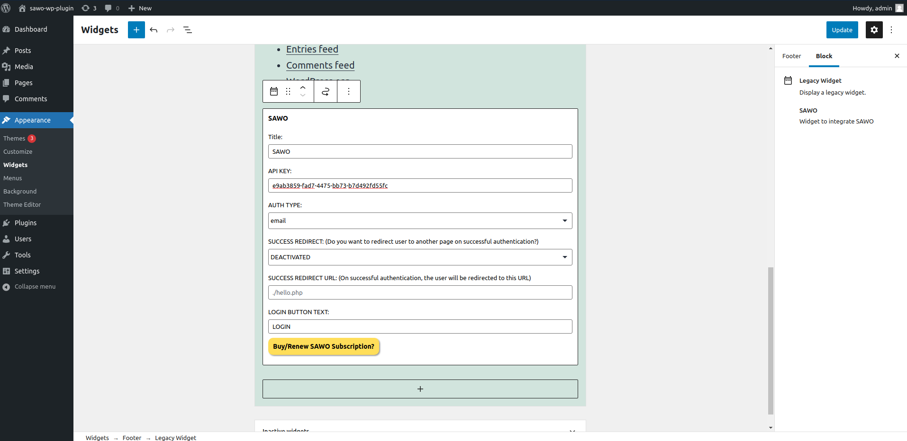

Integrate SAWO in Wordpress
===========================

WordPress is a free and open-source content management system written in PHP and paired with a MySQL or MariaDB database. It can be used to create awesome websites for various purposes.

Let's get our Wordpress App running with SAWO
=============================================

There are no requirememts for Wordpress. So, we will directly move on to the steps.

Steps
-----

We need to follow a few steps to get SAWO integrated into our application.

1. As the first step to getting our Wordpress App to run with SAWO login, we need an essential component, which is the “SAWO API key”. You are probably wondering where we can get these, right? For that, we have to create a project in the SAWO Dashboard, where we can go directly by clicking `here <https://dev.sawolabs.com/>`__.

1.1 Click the “create new project” button. Choose the platform on which we will create our project, where we will be able to see the code beforehand. In this case, it will be “web” as we are creating it on Wordpress. Click continue.

.. image:: ../images/SAWO%2012.png

1.2 Next, give the name of your project. In the “Enter your hostname” section, leave it empty because we will talk about it afterwards. Now, click “create”. There we are. We currently have a project in the SAWO dashboard.

.. image:: ../images/SAWO%203.png

1.3 Now, we can see in the project section the display of details about our project. Open notepad and copy the “API key” because we will need it afterwards.

.. image:: ../images/SAWO%204.png

2. Once we create our project, we would need to set our hostname.

2.1 For development in a local machine, the hostname should be set to 'localhost'. So, write localhost beside the hostname and click "save". 

     - If using ''localhost" as hostname is not working for you, try "127.0.0.1"
.. image:: ../images/SAWO%205.png

2.2 For production, the hostname should be set to your domain.

     - If you are adding your domain, do not add 'https://', ''http://', 'www' or even trailing backslash. Example: We should keep https://dev.sawolabs.com/ as dev.sawolabs.com
.. image:: ../images/SAWO%206.png

3. Firstly, we will go to the WordPress admin panel and click plugins and select 'add new'.

4. After that, we will search SAWO in the plugin search bar.

5. Next, we will Click Install.

6. After installation, we will activate the plugin by going to the Plugins page.

7. Once activated, wewill click Appearance, and then Widgets.

8. Afterwards, we have to add the SAWO widget where ever we want the Login button to be placed on your website.

9. In the SAWO widget, we will paste our API which we copied earlier from the dashboard.

10. After that, we will select ACTIVATE if we want to activate a success redirect page.

11. If we did activate the success redirect page in the previous step, we will enter the URL to which we want your user to be redirected. Every time the user is successfully logged in, he will be redirected to the page for which the URL is entered.

12. Next, we will customize the text we want to display on our LOGIN button.

13. Lastly, we will click 'save'.

14. Once we successfully set up the SAWO SDK with the instructions above, we will get the SAWO login form in our application as shown below:

.. image:: ../images/Untitled%20(10).png

Congratulations! You have successfully integrated SAWO with your Wordpress Application.

Conclusion
----------

Hope you have enjoyed this short tutorial. We know this can be hard for a first-timer. If you got stuck, tell us where you got stuck in the #ask-for-help channel in our `official discord server <https://discord.com/invite/TpnCfMUE5P>`__, and our engineers will help you out.

*Enjoy with SAWO and we will see you next time.*
